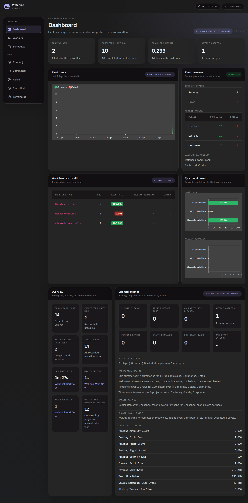
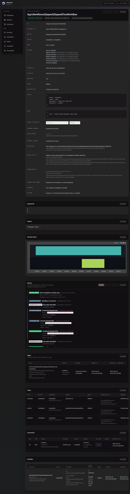

# Waterline

An elegant operator UI for monitoring the technical runtime state of
[workflows](https://github.com/durable-workflow/workflow).

Waterline is for fleet health, queues, waits, retries, failures, repair,
history, and runtime diagnostics. Business dashboards should read
application-owned read models projected at domain milestones, with
`workflow_id` and `run_id` stored only as correlation references.

## Installation

Waterline uses one UI and operator behavior contract with two backend modes:

- Embedded mode is the Composer package inside a Laravel application and adds
  the optional `durable-workflow/workflow` integration.
- Service mode is the self-contained `durableworkflow/waterline` image. It
  needs no host PHP installation and connects to a standalone server through
  the published PHP SDK, never through the server database.

See [Waterline service mode](SERVICE_MODE.md) for the image, deployment inputs,
authorization modes, persistence boundary, and Docker Compose example.

### Embedded Laravel

This UI is installable via [Composer](https://getcomposer.org).

```bash
composer require \
    durable-workflow/waterline:2.0.0-beta.21@beta \
    durable-workflow/workflow:2.0.0-beta.21@beta \
    durable-workflow/sdk:2.0.0-beta.21@beta

php artisan waterline:install
```

The `@beta` stability flags are required while Waterline and its Durable
Workflow runtime dependencies are on the 2.0 prerelease channel. Composer only
honors prerelease stability allowances from the root project, so default-stable
applications must allow all three packages explicitly. Drop the flags after
`2.0.0` is tagged stable for all three packages.

## Authorization

Waterline exposes a dashboard at the `/waterline` URL. By default, you will only be able to access this dashboard in the local environment. However, within your `app/Providers/WaterlineServiceProvider.php` file, there is an authorization gate definition. This authorization gate controls access to Waterline in non-local environments.

```
Gate::define('viewWaterline', function ($user) {
    return in_array($user->email, [
        'admin@example.com',
    ]);
});
```

This will allow only the single admin user to access the Waterline UI.

Isolated observer stacks that have no application users can opt in to
unauthenticated Waterline access:

```dotenv
WATERLINE_ALLOW_UNAUTHENTICATED=true
```

## Configuration

Waterline can display a thin environment strip above the dashboard so production and non-production tabs are visibly distinct before an operator acts:

```dotenv
WATERLINE_ENV_NAME=production
WATERLINE_ENV_COLOR=#dc3545
```

`WATERLINE_ENV_COLOR` accepts hex colors. Invalid values fall back to a neutral gray.

If your workflow IDs are strings (for example UUIDs) and do not sort in a useful order, publish the config and set `workflow_sort_column` to a timestamp column such as `created_at`:

```php
'workflow_sort_column' => 'created_at',
```

### Operator Preferences

Waterline persists small operator view preferences through
`GET /waterline/api/preferences/{surface}` and
`PUT /waterline/api/preferences/{surface}`. Supported surfaces are
`workflow-list`, `run-detail`, `schedules-list`, and `workers-list`; supported
keys are `tab`, `sort_direction`, `row_density`, `saved_view_id`, and
`columns`. Preferences are scoped to the authenticated Laravel user when one is
available, otherwise to `WATERLINE_PREFERENCES_SCOPE` for local installs.

URL query parameters still win for shared links. For example,
`?tab=timeline&sort=asc&density=dense&columns=workflow_id,status` returns those
values in `effective_preferences` without mutating the stored preferences.

## Upgrading Waterline

When upgrading into or within the 2.0 prerelease channel, keep Waterline and
its runtime dependencies on the supported versions shown below and publish the
latest assets.

```bash
composer require --with-all-dependencies \
    durable-workflow/waterline:2.0.0-beta.21@beta \
    durable-workflow/workflow:2.0.0-beta.21@beta \
    durable-workflow/sdk:2.0.0-beta.21@beta

php artisan waterline:publish
```

## Screenshots

The v2 branch keeps repo-owned screenshots in `docs/screenshots/`. They are refreshed by the Screenshots workflow and mirrored into the workflow artifact for visual review.

### Dashboard



### Workflow Detail



## Development

### Quick Start

Get a working Waterline dashboard in under 5 minutes:

```bash
# Clone and install
git clone https://github.com/durable-workflow/waterline.git
cd waterline
make install

# Start development environment (asset watch + server)
make dev
```

Open http://localhost:18280/waterline

The `make dev` command automatically:
- Sets up the SQLite database with migrations
- Builds and watches assets for changes
- Starts the workbench server
- Publishes assets to the correct location

### Available Commands

Run `make help` to see all available commands:

- `make dev` - Start development environment (recommended)
- `make install` - Install dependencies
- `make test` - Run PHPUnit test suite
- `make test-sqlite` / `make test-mysql` / `make test-pgsql` / `make test-mssql` - Run tests on specific database
- `make clean` - Clean build artifacts

### Manual Setup

If you prefer to run commands manually:

1. Install dependencies:
   ```bash
   composer install
   npm ci
   ```
2. Build assets:
   ```bash
   npm run production
   ```
3. Publish assets to testbench:
   ```bash
   ./vendor/bin/testbench waterline:publish
   ```
4. Run migrations:
   ```bash
   ./vendor/bin/testbench workbench:create-sqlite-db
   ./vendor/bin/testbench migrate:fresh --database=sqlite
   ```
5. Start server:
   ```bash
   composer run serve
   ```
6. Access dashboard at http://localhost:18280/waterline
