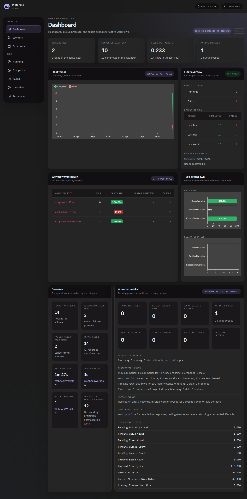
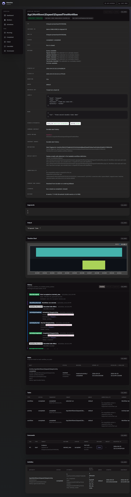

# Waterline

<p align="center">
  <a href="https://github.com/durable-workflow/waterline/actions/workflows/php.yml?query=branch%3Amain"></a>
  <a href="https://packagist.org/packages/durable-workflow/waterline"></a>
  <a href="https://hub.docker.com/r/durableworkflow/waterline"></a>
  <a href="LICENSE"></a>
</p>

Waterline is the operator UI for the technical runtime state of
[Durable Workflow](https://github.com/durable-workflow/workflow).

Waterline is for fleet health, queues, waits, retries, failures, repair,
history, and runtime diagnostics. Business dashboards should read
application-owned read models projected at domain milestones, with
`workflow_id` and `run_id` stored only as correlation references.

## Installation

Waterline uses one UI and operator behavior contract with two backend modes:

- Embedded mode is the Composer package inside a Laravel application and adds
  the optional `durable-workflow/workflow` integration.
- Service mode is the self-contained `durableworkflow/waterline` image. It
  needs no host PHP installation and connects to a standalone server through
  the published PHP SDK, never through the server database.

See [Waterline service mode](SERVICE_MODE.md) for the image, deployment inputs,
authorization modes, persistence boundary, and Docker Compose example.

### Embedded Laravel

This UI is installable via [Composer](https://getcomposer.org).

```bash
composer require \
    "durable-workflow/waterline:^2.0" \
    "durable-workflow/workflow:^2.0"

php artisan waterline:install
```

The standalone PHP SDK is not part of the embedded dependency graph.

In embedded Laravel mode, Waterline uses the host application's resolved
configuration. Set `WATERLINE_*` values before running `php artisan config:cache`
when the host's config files use `env()`. A later process environment change
does not override the cached configuration or an explicit literal value in
`config/waterline.php`. The standalone service image continues to apply its
documented runtime environment settings.

An embedded host that deliberately depends on the older post-cache behavior
can opt in with `waterline.runtime_environment_overrides=true` (or
`WATERLINE_RUNTIME_ENVIRONMENT_OVERRIDES=true` when its config file uses `env()`).
This permits process variables to replace resolved application values, so keep
it disabled when pinning an engine or migration view in Laravel config.

## Authorization

Waterline exposes a dashboard at the `/waterline` URL. By default, you will only be able to access this dashboard in the local environment. However, within your `app/Providers/WaterlineServiceProvider.php` file, there is an authorization gate definition. This authorization gate controls access to Waterline in non-local environments.

```php
Gate::define('viewWaterline', function ($user) {
    return in_array($user->email, [
        'admin@example.com',
    ]);
});
```

This will allow only the single admin user to access the Waterline UI.

Isolated observer stacks that have no application users can opt in to
unauthenticated Waterline access:

```dotenv
WATERLINE_ALLOW_UNAUTHENTICATED=true
```

## Configuration

### Worker runtime

The Workers roster's **Worker runtime** column identifies the worker language
(for example PHP, Python or Rust) when the backend reports it. This is separate
from the application's deployment environment. Compatibility heartbeats report
freshness and supported compatibility markers, without runtime metadata. Their
rows display **Not reported** with an explanation. Heartbeat and compatibility
status remain available independently. Waterline preserves runtime metadata
when an observation provides it and does not infer it from the host language.

### Interface language

English is the default. To use Spanish in embedded Laravel or standalone
service mode, set:

```dotenv
WATERLINE_LOCALE=es
```

Use `uk` for Ukrainian. Spanish regional aliases such as `es-ES`, `es-MX`
and `es-419` select the shared Spanish interface.
Use `pt-BR` for Brazilian Portuguese. `pt`, `pt_br` and case variants also
select the Brazilian interface. Other Portuguese regions fall back to English.
Embedded hosts can also set `'locale' => 'es'` in `config/waterline.php`.
Their resolved Laravel configuration takes precedence, including a cached
literal value. Rebuild the host's config cache after changing environment-based
configuration. Standalone service mode applies `WATERLINE_LOCALE` from its
deployment environment. Unsupported locale values and missing translations
fall back to English.

This setting affects Waterline's interface and its page language. It does not
change the host application's locale. Workflow names, run IDs, namespaces,
payloads, original exception messages and machine-readable API states keep
their original values.

Translations live in `resources/lang/{en,es,pt-BR,uk}.json` and
are shared by the Vue interface and server-rendered page. English sentence keys
make missing messages readable. To contribute a language, add its catalog,
register it in `resources/js/localization.mjs` and `app/Support/UiLocale.php`,
and cover its locale and plural rules in the tests. Keep placeholders such as
`{count}` and `{name}` intact. Spanish and Portuguese count messages use two
alternatives in the order `one | other`. Portuguese discrete item counts use
the singular for exactly one, with zero and fractional counts taking the plural.
Ukrainian plural messages use four alternatives
in the order `one | few | many | other`. Translate the complete meaning of
recovery warnings and review terminology and dialog layout in the browser.
Run `npm test`, rebuild with `npm run production`, and commit the generated
assets with the catalog changes.

### Environment banner

Waterline can display a thin environment strip above the dashboard so production and non-production tabs are visibly distinct before an operator acts:

```dotenv
WATERLINE_ENV_NAME=production
WATERLINE_ENV_COLOR=#dc3545
```

`WATERLINE_ENV_COLOR` accepts hex colors. Invalid values fall back to a neutral gray.

If your workflow IDs are strings (for example UUIDs) and do not sort in a useful order, publish the config and set `workflow_sort_column` to a timestamp column such as `created_at`:

```php
'workflow_sort_column' => 'created_at',
```

### Application Context

An application can opt in to a classification and display context for each exact
workflow type in its published `config/waterline.php`:

```php
'observability' => [
    'workflow_types' => [
        'orders.import' => [
            'classification' => 'business_operation',
            'fields' => [
                'order_id' => [
                    'label' => 'Order',
                    'source' => 'search_attributes',
                    'key' => 'order_id',
                ],
            ],
            'links' => [
                'order' => [
                    'label' => 'Open order',
                    'url' => 'https://app.example/orders/{order_id}',
                ],
            ],
        ],
    ],
],
```

The run detail displays only explicitly configured scalar visibility labels or
search attributes. Inputs, outputs and arbitrary metadata are not sources for
application context. Missing fields show `Unavailable`. The context is limited
to 20 fields, 10 links and 512 characters per value. Links require an absolute
HTTP(S) URL with a configured host and no credentials. Placeholder values are
URL encoded, and missing or shortened identifiers do not produce entity links.
The host application's Waterline authorization still controls who can see it.

Useful classifications include `maintenance`, `coordinator` and
`business_operation`. The dashboard and execution-list selectors apply the
application's exact type groups. Dashboard totals, trends and alerts use that
selection. Lists apply it together with the current status, namespace, saved
view and other filters. Selecting a group resets pagination and preserves those
other filters. All workflow types remain available, including maintenance.
The selected classification, namespace and time windows are displayed beside
the selector. Lists show retained runs matching the filters and their observation
time. Worker, queue and storage
metrics keep the full operator scope. A backend without the filtering capability
disables the selector and refuses a manually requested filter with HTTP 501.
Unknown classifications return HTTP 422.

Filtered embedded dashboards require Native 2.4.4 or newer. Filtered service
dashboards require Server 2.5.4 and PHP SDK 2.2.2 or newer. An unsupported selected
filter offers a return to all workflow types.

Classification changes observation only. A coordinator's
completed status describes that run, while related executions retain their own
outcomes. The same configuration applies to embedded and service observers.

### Current Waits

Run details distinguish a future scheduled resume, work eligible to resume,
unknown resume timing and a recorded deadline that has passed. A timer's fire
time is a resume boundary. Elapsed age alone does not make an indefinite signal
wait overdue. Activity retry timing and attempt limits are shown when recorded.

Service mode uses Server's bounded diagnostic summary when full wait projections
are unavailable. The view displays known run timing and each reported activity's
own attempt and deadlines. A run's next task time is not assigned to an activity
without a recorded connection. Partial coverage, unknown totals and unavailable
details remain explicit. Current wait summaries contain at most 50 rows.

### Dashboard History Audits

Canonical run views start with a bounded observation: up to 200 history events,
50 relationships in each direction and ten recent failure references. This
requires Native 2.4.5 in embedded mode, or Server 2.5.5 and PHP SDK 2.2.3 in
service mode. **Inspect full details** loads inputs, results, actions and deeper
diagnostics explicitly. Older runtimes and custom observers without this
capability offer **Open complete details** when the initial summary is unavailable.
Existing full-inspection bookmarks continue to work.

With Native 2.4.3, the dashboard reads aggregate execution data and defers full
history audits. Deferred audit counts display `Unknown`, including the rebuild
total. Open an execution to inspect its history and diagnostics, or request the
runtime's full operator metrics when you need a complete audit.

Service mode uses the same dashboard behavior with Server 2.5.3 and PHP SDK
2.2.1. Older runtimes keep their supported dashboard path. Missing or unavailable
audit information is never presented as a verified zero.

### Recent Failures

Full run details show up to 20 recent reported failures with compact messages and
source identifiers. A history link opens and highlights the supporting event
when it is in the loaded history window. Supporting Server references also
provide a direct, shareable link to a retained failure event outside that window.
The original opaque cursor is preserved and a selected window does not imply
that the whole history has been loaded. Loading another service history page
can make that evidence available. Pruned, unavailable and unloaded history are
labelled explicitly. An empty view does not establish that a run never failed.

### Operator Preferences

Waterline persists small operator view preferences through
`GET /waterline/api/preferences/{surface}` and
`PUT /waterline/api/preferences/{surface}`. Supported surfaces are
`workflow-list`, `run-detail`, `schedules-list`, and `workers-list`; supported
keys are `tab`, `sort_direction`, `row_density`, `saved_view_id`, and
`columns`. Preferences are scoped to the authenticated Laravel user when one is
available, otherwise to `WATERLINE_PREFERENCES_SCOPE` for local installs.

URL query parameters still win for shared links. For example,
`?tab=timeline&sort=asc&density=dense&columns=workflow_id,status` returns those
values in `effective_preferences` without mutating the stored preferences.

### Cancellation Cascade

The cancellation inspection view joins the original root request and
cleanup deadline with each run's local request, delivery boundary, lifecycle,
child policy outcome, activity stop receipts and cleanup recovery. Embedded
mode uses the shared Native reader. Service mode preserves Server's diagnostic
view. Selecting a historical run preserves that selection.

Callback fencing and reported callback exit are shown separately. A missing
stop receipt stays unverified, and a recovery grant does not identify the cause
of worker loss. Independent cancellation roots keep their own deadlines.
Missing or clipped evidence is shown with its findings.

This view requires an installed Native or Server runtime supplying
`durable-workflow.cancellation-cascade/v1`, available in Native 2.4.0 and Server
2.5.0. Service mode uses PHP SDK 2.2.0 or newer. Older runtimes report unavailable
details.

## Upgrading Waterline

When upgrading to 2.0, let Composer resolve the supported package graph together
and publish the latest assets.

```bash
composer require --with-all-dependencies \
    "durable-workflow/waterline:^2.0" \
    "durable-workflow/workflow:^2.0"

php artisan waterline:publish
```

## Screenshots

These screenshots show the stable 2.0 operator surface.

### Dashboard



### Workflow Detail



## Development

### Quick Start

Get a working Waterline dashboard in under 5 minutes:

```bash
# Clone and install
git clone https://github.com/durable-workflow/waterline.git
cd waterline
make install

# Start development environment (asset watch + server)
make dev
```

Open http://localhost:18280/waterline

The `make dev` command automatically:
- Sets up the SQLite database with migrations
- Builds and watches assets for changes
- Starts the workbench server
- Publishes assets to the correct location

### Available Commands

Run `make help` to see all available commands:

- `make dev` - Start development environment (recommended)
- `make install` - Install dependencies
- `make test` - Run PHPUnit test suite
- `make test-sqlite` / `make test-mysql` / `make test-pgsql` / `make test-mssql` - Run tests on specific database
- `make clean` - Clean build artifacts

### Manual Setup

If you prefer to run commands manually:

1. Install dependencies:
   ```bash
   composer install
   npm ci
   ```
2. Build assets:
   ```bash
   npm run production
   ```
3. Publish assets to testbench:
   ```bash
   ./vendor/bin/testbench waterline:publish
   ```
4. Run migrations:
   ```bash
   ./vendor/bin/testbench workbench:create-sqlite-db
   ./vendor/bin/testbench migrate:fresh --database=sqlite
   ```
5. Start server:
   ```bash
   composer run serve
   ```
6. Access dashboard at http://localhost:18280/waterline
